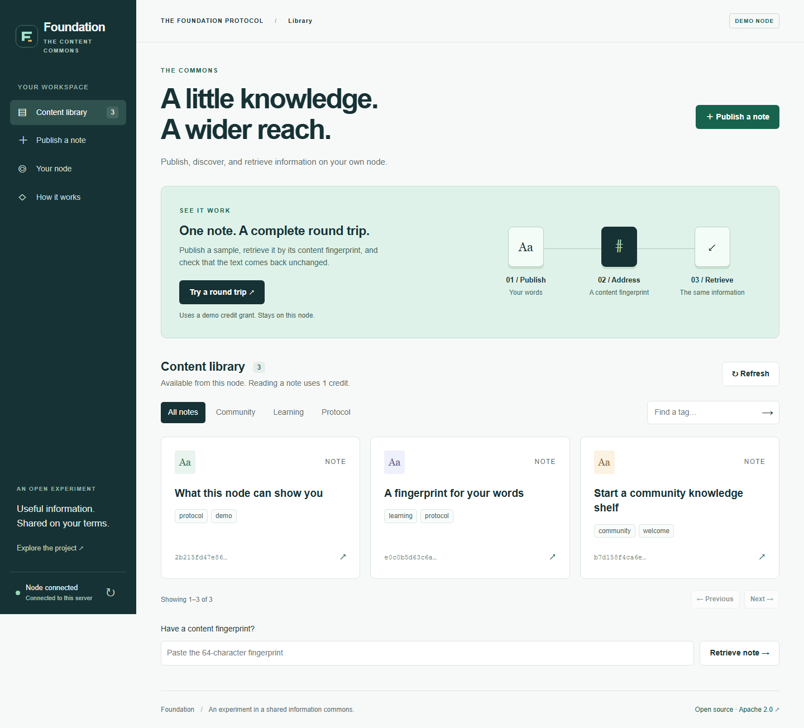

# Foundation

**Shared infrastructure for useful computation and content across devices and community networks.**

Foundation aims to turn affordable contributed work into reusable lexicon resources: shared dictionaries, priors, and adapters that reduce repeated work for other devices and projects. Demand should direct content preparation and delivery, including video, while independently operated networks retain their own policies.

That complete mechanism is still being developed. The local content library demonstrates publishing, discovery, retrieval, and local credit accounting. It does not yet demonstrate useful pooled lexicon construction, benefits on modest devices, demand-scaled video, or federation. The [execution plan](docs/FOUNDATION_MEGAPLAN.md) defines the evidence needed for each step.

For development and AI handoffs, read [AGENTS.md](AGENTS.md). The [purpose/downside review](docs/planning/purpose-and-regression-review.md) records known risks and prevents partial demonstrations from being mistaken for the completed protocol.

[](https://github.com/Bittermun/TheFoundationProtocol/actions/workflows/ci.yml)
[](LICENSE)



## Try it

Use **Python 3.11 or 3.12**. From the repository root, preferably inside a virtual environment:

```sh
python -m pip install ".[cli]"
python -m tfp_cli.main demo
```

Your browser opens at **http://127.0.0.1:8000**. No Docker, cloud account, IPFS daemon, Nostr relay, or API key is needed. The launcher disables external bridges and keeps demo data in `~/.tfp/demo`, separate from other nodes.

1. Click **Try a round trip**. A real API request publishes a sample, retrieves it, and compares the returned text with the original.
2. Open **Publish a note**, write something, and add a tag. Your draft is saved in this browser.
3. Find the note in the **Content library**, read it, copy its fingerprint, or save it as text.
4. Open **Your node** to inspect real counts and your credit balance.

Reading costs one demo credit. **Add 10 demo credits** provides a test allowance; it does not perform computation and the credits are not money. The separate compute pool is available through the CLI and API.

```sh
# A temporary session that leaves no demo database behind:
python -m tfp_cli.main demo --ephemeral

# Choose another port, or run without automatically opening a browser:
python -m tfp_cli.main demo --port 8001 --no-browser

# Verify a real HTTP round trip, then stop the temporary server:
python demo_30sec.py
```

For a short walkthrough to show someone, see the [demo guide](DEMO_GUIDE.md).

<details>
<summary>First-time virtual environment setup</summary>

Windows PowerShell:

```powershell
py -3.11 -m venv .venv
.\.venv\Scripts\python -m pip install ".[cli]"
.\.venv\Scripts\python -m tfp_cli.main demo
```

macOS / Linux:

```sh
python3 -m venv .venv
.venv/bin/python -m pip install ".[cli]"
.venv/bin/python -m tfp_cli.main demo
```

The server runs until you press Ctrl+C in its terminal. Reopen it with the same command to keep using saved notes. Keep the same browser and port to retain your browser identity.

</details>

<details>
<summary>Docker alternative</summary>

```sh
docker compose up --build
```

Open http://127.0.0.1:8000. The demo binds to loopback and uses a persistent Docker volume. The default configuration disables external services. Docker Engine must be running.

</details>

## What works today

| Capability | What is implemented | Boundary |
| --- | --- | --- |
| Content library | Publish UTF-8 notes, browse by tag, paginate, retrieve, download | Local node; identical bytes share an address and can have updated metadata |
| Content addressing | SHA3-256 fingerprints and an exact-text round-trip check | A fingerprint does not establish authorship or truth |
| Browser identity | Generated device secret, HMAC request signing, persistent enrollment | Software identity in browser storage; no hardware attestation |
| Credits | Persistent balances, one-credit reads, replay checks, concurrent-read protection | Local experimental accounting; demo grants bypass computation |
| Compute pool | Task generation, result submission, consensus-related bookkeeping | Experimental; not a demonstrated permissionless economy |
| Offline reading | Previously opened notes can be returned from this browser's cache | Requires the same retrieval address/identity; no offline publishing or live metrics |
| Network research | Chunking, custom fountain codec, peer routing, Nostr/IPFS adapters | Separate integrations and tests; the local UI does not demonstrate a deployed mesh |

**This is a prototype, not a production-ready network.** It has not undergone an independent security audit. Multi-node bandwidth savings, censorship resistance, hardware-backed Sybil resistance, and public deployment reliability have not been established by this demo. The custom erasure codec is not an RFC 6330 RaptorQ implementation.

The configuration named `production` enables additional restrictions; the name is not a security certification. In demo mode, legacy unsigned reads remain accepted for compatibility. Use the local launcher for demonstrations and sample content. See the [current review and limitations](docs/PROJECT_REVIEW.md) before considering a public node.

## How it fits together

```text
Browser / CLI
    │
    ├── enroll a device and sign requests
    ├── publish text → SHA3-256 content address
    ├── find notes by tag
    └── retrieve bytes → spend one credit
                │
          FastAPI demo node
                │
      SQLite metadata + credit ledger
                │
           Local blob storage
```

The source layout contains an older protocol directory alongside newer root modules. **Install from the repository root.** The root package combines them into one wheel, including the interface; it does not depend on running inside a checkout.

| Location | Purpose |
| --- | --- |
| `tfp-foundation-protocol/tfp_demo/` | FastAPI application, storage, runtime configuration |
| `tfp-foundation-protocol/demo/` | Browser interface and service worker; no frontend build step |
| `tfp-foundation-protocol/tfp_client/` | Protocol adapters, compute tasks, credit ledger, peer services |
| `tfp_cli/` | CLI, local demo launcher, HTTP smoke check |
| `tfp_core_v4/`, `tfp_transport/` | Experimental chunking, Merkle, fountain, and transport work |
| `tests/`, `tfp-foundation-protocol/tests/` | Integration, unit, concurrency, and property tests |

## Check the work

```sh
python -m pip install ".[test,dev]"
python -m pytest -q
python -m ruff check tfp-foundation-protocol
python demo_30sec.py --json
```

CI runs both test trees and checks a built wheel in a separate environment. The [review](docs/PROJECT_REVIEW.md) records the validation performed for this revision and its limits. Test counts and local timings are evidence about those checks, not network performance claims.

The [browser check](scripts/check_demo_browser.py) exercises publishing, reading, filters, drafts, offline behavior, and mobile layout. Setup and commands are in the [demo guide](DEMO_GUIDE.md).

## Read more

- [Demo guide](DEMO_GUIDE.md) — a short, repeatable presentation
- [Project review](docs/PROJECT_REVIEW.md) — changes, evidence, and remaining work
- [Execution megaplan](docs/FOUNDATION_MEGAPLAN.md) — full mission, priorities, hidden risks, experiments, and implementation gates
- [Architecture](ARCHITECTURE.md) — deeper component map
- [API integration guide](tfp-foundation-protocol/docs/v3.0-integration-guide.md) — detailed protocol reference; see the review for current behavior changes
- [Contributing](CONTRIBUTING.md) — development workflow
- [Security reporting](SECURITY.md)
- [Roadmap](ROADMAP.md)

Older plans and benchmark documents are research history. They are not current deployment guarantees or validated performance claims.

## Why this exists

This project began with a student's question: could decentralized information sharing use bandwidth more effectively? It was built with AI assistance. The next step is to make its assumptions testable, its limitations visible, and its useful parts easier for others to try and improve.

Contributions that reproduce a bug, strengthen a test, or demonstrate a real network result are especially welcome. [Open an issue](https://github.com/Bittermun/TheFoundationProtocol/issues).

Apache 2.0 — see [LICENSE](LICENSE).
