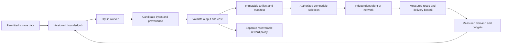

# Foundation: execution megaplan

Prepared 2026-09-12. Status: **implementation underway; full mission gates remain unverified**. This document preserves the full intent in [AI_HANDOFF.md](../AI_HANDOFF.md). It extends the initial [project review](PROJECT_REVIEW.md) with new component evidence, dependencies, failure handling, and a staged execution board. Consult the [execution review](planning/execution-review-2026-09-14.md) for subsequent work; the original observations below are historical snapshots.

**Build a system in which affordable contributed work improves shared resources, other devices and projects reuse them, and demand directs preparation and delivery across independently operated networks.** The content notebook is one demonstration. A dictionary experiment, a green test suite, or a successful local launch is not completion of that goal.

Start with W00, W01, and W02 below. Do not start fifteen implementation streams. [The execution board](planning/execution-board.json) tracks packet state and dependencies; this document records rationale, acceptance meaning, and design boundaries. The user's objective and current reproducible evidence take precedence over stale plan or board entries. A failed candidate is not a failed mission, and a passing candidate is not a completed system. Dates and source fingerprints in the evidence must travel with any claim.

## 1. What this plan must preserve

| Mission requirement | Observable outcome needed | Work packets | Evidence gate |
| --- | --- | --- | --- |
| M1: weak devices contribute meaningfully | A measured modest device produces accepted useful output within an enforced budget and gains a direct benefit beyond credits | W05, W06, W07 | G5, G6 |
| M2: pooled computation improves a shared lexicon | Workers produce or improve a versioned resource that other clients actually consume; sharing and pooling each have measured value | W02–W07 | G2–G6 |
| M3: the resource reduces content-management and system-building work | A separate application reuses it with lower repeated preparation, transfer, or integration work | W04, W08 | G4, G7 |
| M4: video scales automatically with demand | Demand changes completed preparation/distribution work; equal-quality playback benefits under measured load | W09, W10 | G8, G9 |
| M5: devices can serve other projects and independently built networks interoperate | A worker can choose another approved project; two separately configured networks exchange compatible resources while retaining local policy | W11–W13 | G10–G12 |
| M6: the user can understand, trust, and demonstrate the result | Repeatable installation and journey, visible real results and limitations, recoverable state, and a reviewable checkpoint | W00, W01, W14 | G0, G1, G13 |

The final lexicon representation, video mechanism, trust model, and acceptable resource tradeoffs remain design decisions. Investigate them explicitly. Do not silently convert the lexicon into tags, convert demand scaling into bitrate adaptation alone, or convert federation into one operator running two copies of the same process.

## 2. Evidence that changes the order of work

Repository HEAD was `42b31829dc8623a38a5c30ffffd4e37173ed671f` at inspection. The worktree contains substantial earlier uncommitted repairs; HEAD alone does not identify the inspected code. The [saved probe report](planning/source-probes-2026-09-12.json) fingerprints the exact source files used for eight bounded observations. It ran on Python 3.11.1 and used local objects, not deployed services.

Reproduce the observations from the repository root:

```powershell
py -3.11 -B scripts/inspect_plan_assumptions.py
```

The [inspection script](../scripts/inspect_plan_assumptions.py) reports observations, not release pass/fail. `concern_observed: true` is a counterexample to an intended property, not a passing implementation test. Some observations are design ambiguities rather than exploitable defects. Runtime coverage must be established separately.

| Evidence | Observed behavior | Why it matters | Required response |
| --- | --- | --- | --- |
| P1 | Lexicon sync accepts a deliberately wrong expected root, reports `synced`, and retains the added adapter | A client can believe it shares the same prior when it does not | W03: stage updates, verify the expected state, activate atomically or leave the previous state untouched |
| P2 | Changing the active domain pointer changes the selected lexicon version without changing the tree root | The current commitment does not identify all state that influences selection | W03: commit the authoritative selection/dependency state or identify it separately with an authenticated manifest |
| P3 | Adding v1.0.0 after v2.0.0 selects v1.0.0 as latest | Out-of-order announcements can roll a client backward | W03: separate immutable versions from authorized active-version selection |
| P4 | Adapter v1.9.0 sorts ahead of v1.10.0 | String ordering is not semantic version ordering | W03: define version ordering and compatibility; test boundary cases |
| P5 | Equal logical delta mappings with different insertion order produce different hashes | Byte identity and semantic identity have not been separated | W03: define canonical serialization for logical manifests; raw artifact blobs retain byte hashes |
| P6 | Requests an hour old remain in a one-second demand window; a two-hour window gives the same result | The window parameter does not currently implement recent demand | W09: timestamp/aggregate bounded windows and test demand decay |
| P7 | Local `TFPNode.fetch` recovers bytes with simulated loss set to 100%, by reintroducing locally stored droplets | The local helper cannot establish recovery from unavailable remote information | W01/W10: explicit sender/receiver stores, metered repair requests, bounded retry budgets |
| P8 | Two local publishes report 50% bandwidth saved without a network operation | Chunk-count reuse is being presented as network savings | W01: distinguish reused chunks, reused bytes, actual link bytes, and avoided origin bytes |

Additional source observations, not independently exercised endpoint exploits:

- [Task result handling](../tfp-foundation-protocol/tfp_demo/server.py) accepts a reported hash rather than a reusable output; generated task specs expose expected hashes. [The E2E test](../tfp-foundation-protocol/tests/test_e2e_flow.py) copies that expected hash into three submissions and tests spending by the triggering device. It does not establish useful execution or payment to every qualifying participant.
- The task generator solves/prepares known answers centrally. Dispatching this same computation elsewhere does not automatically save coordinator work. W04 separates resource reuse from pooling; W05 removes unnecessary pre-solving only after defining real validation.
- Task completion is committed before automatic reward application. Reward application records the replay claim before minting/persistence completes. [Restart tests](../tfp-foundation-protocol/tests/test_restart_safety.py) use two application lifecycles in one process, not arbitrary process termination between writes. W00/W06 require crash-boundary tests and reconciliation.
- The [sandbox](../tfp_core/security/sandbox.py) returns `mock_result` when its backend is unavailable; its execution timeout wrapper directly invokes the function. W12 must establish real limits before accepting arbitrary external code. Built-in, reviewed jobs still need bounded execution in W05.
- [v4 chunk recipes](../tfp_core_v4/cdc.py) call a digest over the sequence of chunk hashes `root_hash`; the content demo identifies raw content by SHA3-256. Identically shaped strings are not evidence of interchangeable identifiers. W03 requires typed identity and compatibility tests, not a global hash rename.
- [BlobStore](../tfp-foundation-protocol/tfp_demo/server.py) writes blobs directly, separate from metadata commits. Its path containment checks use string prefixes. W03/W06 must test partial writes, sibling-prefix paths, and durable publication before exposing general artifact ingestion. No remote path exploit was demonstrated here.
- [The old Definition of Done](../DEFINITION_OF_DONE.md) expects all participant rewards, real task execution, restart behavior, and broader gates than the current E2E/CI evidence establishes. Old packaging commands also point at the nested tree. W00 reconciles the requirements; it must not delete inconvenient requirements merely to produce a green badge.

## 3. The non-obvious design consequences

### A. Shared state creates a dependency, not only a saving

A small content reference can depend on a large prior, a specific decoder, and an update chain. Include that dependency closure in cold-start bytes and memory. Pin every dependency needed by retained content; bound graph depth, fan-out, total expanded bytes, and recursion. Reject cycles. Do not garbage-collect an old dictionary while retained content still needs it. Make a cache eviction followed by exact restoration part of the demonstration.

Separate immutable artifacts from mutable discovery announcements. A content hash proves byte identity; it does not establish who may select a new version or whether a resource is useful. A domain may fork. Two communities may disagree about the active version without either corrupting historical content. Resolve by explicit authority and policy, not last-arriving packets or a universal global “latest.”

An offline node may retain an already approved version when freshness information is unavailable. It must distinguish “usable pinned content” from “freshly authorized update.” Clock uncertainty, expiry, and revocation need a policy that preserves offline usefulness without claiming fresh trust. TUF is a design reference for authenticated update metadata, rollback/freeze detection, and role separation; adopting selected ideas does not establish TUF compliance. [TUF specification](https://theupdateframework.github.io/specification/latest/)

### B. Resource usefulness, worker correctness, and worker honesty are different

An output can be valid but useless, useful but already available, or honestly computed but too expensive to verify. A hash is neither a proof of execution nor a measure of benefit. Three enrolled device IDs are not three independent operators. A software-generated mnemonic or a `has_tee` flag is not hardware attestation.

Keep five questions separate: did the artifact arrive intact; does it satisfy its job; does it help the held-out workload; should this client install it; is any reward owed? A known valid duplicate may be accepted idempotently without paying twice. Do not make credit issuance a prerequisite for verifying or decoding content. Correctness must survive zero credits and a disabled reward subsystem.

For the controlled prototype, reviewed built-in jobs and a named verifier are an explicit starting trust model. That is a checkpoint, not the final permissionless network. A future probabilistic verifier needs a stated adversary, independence assumptions, miss rate, sample budget, and challenge policy. Full re-execution is useful correctness evidence and must be fully charged to the experiment.

### C. Pooling is constrained by locality and the slowest dependencies

Tiny tasks can cost more to describe and transport than to execute. Large tasks exclude weak devices, suffer lost work on interruption, and require larger verification buffers. Batch only until dispatch overhead is amortized within the device's execution/memory budget. Prefer available local inputs and reused worker runtimes; include cold runtime initialization in the cold case. Measure communication-to-compute ratio and coordinator queue time.

Do not make every job wait for the slowest participant. Use bounded leases, idempotent attempts, compatible checkpoints where economical, cancellation, and backpressure. A timeout changes an attempt's state; it does not prove bad behavior. CPU throttling and a declared “mobile” profile are not substitutes for an actual device. A low-end Windows/Linux worker is a legitimate first hardware result, with Android/iOS/browser execution left explicit until tested.

### D. Demand signals can amplify waste

Popularity accumulated over all time, cache misses, and recent unique demand are different signals. Retries can inflate counts; successful caching can hide demand. Record requests served at caches while deduplicating retry identifiers within bounded windows. Do not record more viewer identity than the policy requires.

Prioritize expected avoided future work under byte, compute, storage, and fairness budgets. Add hysteresis and cooldown so content does not oscillate between replicas. Reserve some service for unpopular content; otherwise new and niche resources never accumulate evidence of usefulness. Demand expiry must cancel unnecessary queued work. Job completion, not queue insertion, triggers the claimed availability improvement.

For video, viewers may be watching different segments at different times. One popular title does not imply one useful broadcast. Compare requests aligned and unaligned in time. Keep video bitrate/quality and startup constraints equal. A logical P2P broadcast implemented as N unicasts still consumes N links' traffic. Count aggregate traffic and bottleneck traffic separately; lower origin load can coexist with higher total network cost.

### E. The transformation order can erase the benefit

Changing dictionaries can change compressed bytes, reducing chunk reuse across versions. Chunking, delta encoding, compression, encryption, fountain redundancy, and signing do not have interchangeable order. Benchmark a small set of explicit pipelines and identify exactly what each manifest authenticates. Keep pre-encoded video intact for the first demand experiment. Cross-user deduplication or public dictionary training on private content needs a deliberate trust boundary; do not assume encrypted content supports the same sharing strategy.

Dictionary compression can expose information through shared state and compressed sizes. The initial experiment uses public or specifically permitted data within a declared sharing scope. HTTP dictionary transport has its own raw-dictionary format and origin/cache rules; a trained Zstd dictionary is not automatically that wire format. [RFC 9842](https://www.rfc-editor.org/rfc/rfc9842.html)

### F. Interoperability needs shared contracts, not shared government

Make artifact identity and decoding portable first. Separate content discovery, resource distribution, task dispatch, trust, and accounting. Networks must be able to exchange content without accepting each other's workers, update authorities, or credits. Federation identifiers include the network/issuer and protocol version. Capability negotiation must distinguish unsupported optional features from missing required verification.

Partitions require retry-safe convergence and visible conflict handling. Do not merge local supply totals by summing gossip values. Decide whether credit domains are local, mutually settled, or globally scarce before attempting cross-network spending. In the first federation experiment, accounts remain local and workers explicitly opt into each project's approved jobs. That boundary is recorded as a staged limitation, not a completion claim for universal interoperability.

## 4. A minimal architecture that can grow

Keep the current server as the initial coordinator. Avoid a second parallel task framework. Use existing storage, task dispatch, and HLT concepts after repairing their required invariants. Extract interfaces around observed boundaries; split services only when measured contention, isolation, or independent deployment justifies it.



Proposed contracts to freeze in W03/W05; these are design requirements, not existing APIs:

| Contract | Minimum contents and invariant |
| --- | --- |
| Artifact | Typed digest algorithm + digest, byte length, media/representation type, immutable bytes; the same ID cannot resolve to different bytes |
| Manifest | Schema version, artifact/dependency IDs, decoder/algorithm version and parameters, fidelity mode, original-content identity, decoded-size limits, provenance/rights scope; canonical signed or authenticated fields |
| Selection | Namespace/issuer, domain, approved artifact/version, predecessor/epoch, authority and freshness policy; independent of arrival order |
| Job | Network/project ID, recipe/version, inputs, resource/output bounds, deadline/lease policy, validation rule, result requirements, cost/reward policy; no executable code fetched implicitly |
| Result | Job ID, attempt ID, input/recipe commitment, artifact ID/bytes or verified retrievable reference, observations and validation record; request authentication binds relevant body fields |
| Demand | Artifact/segment identity, bounded time bucket, eligible request count, locality and confidence; not a globally unique viewer identifier |
| Receipt | Issuer, job/result/participant identity, policy version, durable status and idempotency key; no payment inferred merely from a content hash |

Canonical artifact lifecycle: `candidate → validated → durably stored → selectable → retained → retired`. Rejected candidates never become active. Retirement prevents new selection while retained dependencies remain available. Revocation and deletion have distinct meanings; a local deletion cannot promise erasure from independently operated caches.

Job lifecycle: `queued → leased → submitted → validated/rejected → settled`. Expired/cancelled attempts can be retried under new attempt IDs; settlement remains unique under its policy. Persist the useful result independently of reward availability. Write blobs to temporary files, verify, durably publish, then commit references and journal the remaining effects. Recover orphan blobs and incomplete settlements. Validate the actual platform's rename/fsync/database behavior; do not infer cross-store atomicity from a Python lock.

## 5. Experiments that can disprove the attractive story

### E1: Separate sharing from pooling

Use one permitted, realistic family of small records first. Freeze content hashes, provenance, train/tune/final splits, request traces, update schedule, baseline configurations, environment, and practical resource limits before final evaluation. Split by source/time where near-duplicates could leak. Train only on the training subset; select candidates on tuning data; run the frozen final set once per declared configuration. Any later tuning requires a new final set or an explicitly exploratory claim.

| Variant | Purpose |
| --- | --- |
| A | Ordinary compression plus fair caching/deduplication; also test batching or persistent compression where the workload permits |
| B | The same delivery conditions with a centrally built shared artifact |
| C | The same artifact algorithm produced through contributor jobs with all orchestration/validation costs included |
| Controls | Unrelated records; already-compressed files; new clients; cache eviction; frequent updates; negative or disappearing demand |

Use Zstandard's dictionary tooling to avoid inventing a codec for the first comparison. Its documented benefit depends on correlated small inputs; there is no universal dictionary. A positive result supports that specific workload only. [Zstandard documentation](https://facebook.github.io/zstd/#small-data)

Measure at least transferred input/output/artifact/control/retry bytes by link, coordinator/worker/client CPU, elapsed and queue time, peak memory, persistent storage, verification cost, fallback count, and exact reconstructed output. Report directly measured energy when available; label CPU time and battery-level changes as proxies if used. Include maintenance, update and retention costs, not only initial training.

Show first use and reuse at 1, 5, 20, and 100 reads per client as sensitivity cases, then weight by the actual pilot trace. Report aggregate distribution cost across clients; ten clients downloading a dictionary once is ten deliveries. Use repeated trials and dispersion for timing; resample independent sessions/devices rather than pretending correlated records are independent. Publish failures and outliers with reasons.

Practical gates are frozen in W02. Suggested exploratory targets are at least 10% net transfer reduction for B versus the best applicable A at realistic reuse, exact output in all valid cases, no more than 5% p95 latency regression, and a bounded modest-worker profile starting at one CPU, 256 MiB process memory, and five seconds per job. These are proposed engineering thresholds, not observed results, hardware-safety standards, or final user preferences. Calibrate them on diagnostic data and actual device capability before opening final evaluation data; never relax them after seeing the result.

C must show a predeclared practical advantage over B, such as meeting a coordinator capacity limit or exploiting locally available inputs, while meeting total network, compute/energy, latency, and participant budgets. Moving expense to volunteers without their informed limits is not a saving. If B wins and C loses, keep B's evidence and redesign the pooled work. That does not complete the pooled-compute objective.

### E2: Test the wider lexicon hypothesis without hiding behind the dictionary

After E1, compare only the next two candidates justified by the adopter's workload: an incrementally maintained domain resource and, if still relevant to the user's intended mechanism, a learned prior/adapter with explicit content-specific residuals. Evaluate management work avoided, decoder availability, dependency size, update churn, and cold use. Do not train a model merely to make the diagram more ambitious.

Exact reconstruction is the default research contract. If a future semantic/perceptual representation changes original content, it needs a separate identity, fidelity label, quality evaluation, and a user decision before substitution. Cross-device numeric nondeterminism and model/runtime versions belong in that experiment. A successful dictionary result cannot be renamed “generative lexicon complete”; a failed dictionary does not falsify every possible shared prior.

### E3: Useful contribution on a real modest device

Run at least one supported modest machine and a separate consuming client; add a second device class before broad hardware claims. Record hardware/OS/runtime, memory, startup cost, sustained workload, foreground responsiveness, disconnects, sleep, low-power behavior, cancellation latency, and resumed work. Collect only available sensors and apply device-specific limits; a missing temperature sensor must not manufacture a safe reading.

Require an accepted output plus direct benefit, such as less repeated local preparation, reduced subsequent download cost, or continued access to a useful cached resource. Show both contributor and recipient accounting. The experiment should still be meaningful with credits turned off. Phone/browser clients and arbitrary plugins require their own runtime gates.

### E4: Demand-scaled video

Test one permitted pre-encoded clip, multiple segments, at least two real delivery nodes, and real player clients. Start with demand-driven preparation/replication and request coalescing; compare separately with any later broadcast, multicast, or coded delivery mechanism. Use a workload generator for larger populations and label generated viewers distinctly from real devices.

Include cold launch, popularity burst, time-shifted viewing, low-demand titles, seeks, churn, intermittent uplink, replica failure, and declining demand. Start at 1, 5, and 20 concurrent requests and increase only while instrumentation is trustworthy; these are experimental scale points, not promised capacity. Hold media quality constant. Measure startup delay, p95 segment completion, stalls, origin and total link bytes, wasted prepared bytes, control traffic, and cancellation. Compare with ordinary caching at the same cache/storage budget.

All repair data must come from an explicit sender/peer and traverse the measured transport. Run a no-sender/no-survivor negative control: recovery must fail within budget. Establish need and actual transport support before custom fountain tuning, transcoding, radio deployments, or claims about Internet multicast.

### E5: Other projects and independent networks

Use two separate node configurations/stores and an independently authored consumer or adapter. Exchange an artifact without sharing databases, hard-coded paths, secrets, or implicit trust. Test older/newer compatible schemas, unknown required features, namespace collisions, revoked/unavailable dependencies, partition/rejoin, looped announcements, quota exhaustion, and exit from a peering agreement.

A worker chooses which project and built-in job classes to accept. Verify refusal, cancellation, resource quotas, and accounting isolation. Measure setup steps, integration effort, and avoided work for the outside application. A temporary compatibility shim is acceptable if documented and exercised; it is not proof of universal network interoperation.

## 6. Ordered work packets and gates

Roles name responsibilities, not a claim that people are assigned. Engineering and evaluation can initially be performed by the same implementer, with review evidence kept separate. “S” means roughly one focused workday, “M” roughly two to four, “L” roughly five to ten, and “R” an unresolved research/partner dependency. These are planning ranges, not calendar commitments; re-estimate after the first reproduction or experiment. Only W00, W01, and W02 begin ready.

| Packet | Smallest deliverable | Dependency | Size / accountable role | Exit evidence |
| --- | --- | --- | --- | --- |
| W00 | Preserve and validate the repaired checkpoint; fix bounded audit execution and local accounting defects; reconcile legacy gates and product copy | None | M / engineering | G0: exact source/wheel identity, full applicable checks, real process restart/crash cases, browser journey; accurate checkpoint limitations |
| W01 | Correct measurement boundaries and record one explicit link-level transfer trace; separate simulation from deployment evidence | None | S–M / evaluation | G1: P7/P8 cannot support network claims; transfer counters match a known-byte workload including retries; evidence records identify fallback and simulated actors |
| W02 | One workload profile, permitted corpus/splits, real request/update pattern, modest hardware profile, and frozen success budgets | None | S + R / product and evaluation | G2: reproducible workload manifest and predeclared thresholds; partner availability explicitly recorded |
| W03 | Typed artifact/manifest/selection contract; repaired HLT update/selection path; bounded dependency closure | W00, W01 | M / protocol engineering | G3: P1–P5 regression cases, reordered updates, missing/cyclic dependencies, wrong hashes, rollback, retention and canonical interoperability cases |
| W04 | E1 A/B comparison and E2 candidate decision, with cost attribution and a negative result path | W01, W02 | M + R / evaluation | G4: useful shared resource on held-out workload or explicit failure; no pooled or full-lexicon claim from A/B alone |
| W05 | One bounded built-in job producing actual useful artifact bytes; no unnecessary known-answer precomputation | W03, W04 | M / compute engineering | G5: separate worker, enforced time/memory/output budgets, corrupt output rejection, reproducible recipe, cancellation and input locality accounting |
| W06 | Recoverable result installation and settlement, with agreed participant eligibility and unique effects | W00, W05 | M / persistence engineering | G5: injected failures at publication/validation/settlement boundaries; restart converges; all eligible participants receive exactly their entitlement |
| W07 | E1 C/B result and E3 actual modest-device contribution plus direct benefit | W02, W06 | M + R / device evaluation | G6: real hardware evidence, budget enforcement, full costs, useful pooling advantage or explicit redesign decision |
| W08 | One separate application's artifact-consumption adapter and compatibility fixture | W03, W04, W06 | M + R / integration | G7: clean client imports/consumes compatible artifacts, restores dependencies after eviction, uses fallback, and measures avoided work |
| W09 | One demand signal causes one bounded, deduplicated, cancellable job and completed availability change | W01, W06, W08 | M / scheduling | G8: P6 regression, old/retry demand, burst/decay, quotas, fairness, replica completion and retirement; no endless amplification |
| W10 | E4 video delivery experiment and chosen mechanism based on equal-quality comparison | W07, W09 | L + R / media and evaluation | G9: player/transport traces, bounded negative controls, comparative cost and playback evidence, clear simulated-versus-real scale |
| W11 | E5 artifact federation with local policy and accounting boundaries | W03, W08 | L + R / integration | G10: two independent configurations plus separate consumer, partition/rejoin and compatibility tests, no shared secret/database shortcut |
| W12 | Real capability-limited runtime for third-party jobs/plugins, if enabled | W05, W06, W07 | L + R / runtime engineering | G11: real backend, infinite-loop and oversized-output interruption, memory limits, denied host access, no fallback mock success |
| W13 | Cross-project worker enrollment/selection, trust and incentive policy, and adversarial allocation tests | W07, W11, W12 | L + R / protocol and product | G12: opt-in boundaries, Sybil/collusion assumptions, no reward for copied/non-useful work, quotas and accountable settlement; remaining open-network limits explicit |
| W14 | Reproducible complete pilot, migration/recovery exercise, external review, truthful release package and demonstration | W00–W13 | M + R / release owner | G13: every mission row has appropriate evidence; fresh install, independent reproduction, restart/partition recovery, cost report, support/rollback notes |

W04's success is a research gate, not a permission to keep retrying until a selected benchmark wins. A failure yields a documented causal diagnosis and the next candidate under W02's rules. W12 can remain disabled in an intermediate built-in-jobs pilot, but W14's full extensible outcome then remains incomplete. Exploration of video or federation can inform design earlier; integration claims still require the dependencies above.

Immediate sequence:

1. Preserve a source inventory and reproduce the timeout/accounting cases in W00. Retain earlier edits; use coherent reviewable changes. Correct mission copy with demonstrated/component/intended labels.
2. In W01, isolate a sender and receiver and establish literal bytes sent/received. Keep P7/P8 as evidence of the previous measurement boundary, not as the new benchmark.
3. In W02, inventory local public sample content and available hardware. Prepare the corpus protocol and adopter brief while any external answer is pending; mark synthetic proxies honestly.
4. Start the small A/B experiment and W03's identity/update repairs before wiring pooled artifact creation. Research and prerequisite repairs can proceed independently; runtime rollout waits for both.
5. Review evidence at G3/G4. Continue with one useful job if justified; otherwise change the candidate or workload hypothesis, preserving the full objective and the negative evidence.

Work-in-progress limit: at most one runtime change and one independent experiment at a time for a single implementer. A newly found correctness or measurement defect takes priority over a feature that depends on it. Do not spend an entire iteration fixing unrelated lint or splitting the server. After two bounded investigations without reduced uncertainty, rewrite the hypothesis or obtain the missing outside input rather than adding infrastructure.

## 7. Pre-mortem: what would make this fail six months from now?

| Risk | Early warning | Prevention / recovery | Owner packet |
| --- | --- | --- | --- |
| R01: shared prior mismatch silently changes interpretation | “Synced” despite different roots or active versions | Staged verification, complete identity commitments, exact reconstruction and immutable history | W03 |
| R02: dictionaries look good only with reused training data | Huge warm wins; poor new-source performance | Source/time split, frozen final set, ordinary compression/caching baseline and negative controls | W02, W04 |
| R03: pooling exports more data/work than it saves | Dispatch/validation dominate execution | Input locality, bounded batch size, C/B comparison; redesign the job on failure | W05, W07 |
| R04: cold clients never reach break-even | Artifact updates/evictions precede payback | Per-client reuse curves, retention budget, optional download and fallback; retire unhelpful resources | W04, W08 |
| R05: a version update destroys cache/dedup savings | New compressed hashes despite little logical change | Compare transformation order, bound update frequency and delta chains, pin older content dependencies | W03, W04 |
| R06: honest contributors lose rewards on failure | Completed task with missing balance/receipt or only last submitter paid | Durable entitlement table/journal, explicit eligibility policy, failure injection and reconciliation | W00, W06 |
| R07: fake demand or colluding devices consume the pool | High job volume without useful consumption | Per-project quotas, real-output validation, demand deduplication/expiry and bounded independent validation | W09, W13 |
| R08: weak devices are nominal members only | Jobs assigned but routinely cancelled; benefit only appears as credits | Actual-device telemetry, interruptible jobs, scheduling by fit, direct reuse measurement | W05, W07 |
| R09: video costs are hidden in peers | Origin traffic falls while total bytes/stalls increase | Per-link counters, equal-quality cache baseline, locality/time-alignment tests and budgeted replicas | W01, W10 |
| R10: feature names masquerade as enforcement | Mock backend succeeds; time/memory config has no effect | Backend identity in reports; actual infinite-loop, memory and forbidden-host-operation tests | W12 |
| R11: public sharing leaks private corpus or demand | Artifacts mix tenants; decoder fetches reveal interests | Explicit data provenance/sharing scope, tenant/authority separation, minimal demand identifiers | W02, W03, W13 |
| R12: federation imports another network's authority/economy | Remote node can select local “latest” or mint/spend locally | Typed namespaces, local policies and ledgers, explicit peering, revocation and exit tests | W11, W13 |
| R13: offline clients cannot update safely or decode old content | Expired metadata or missing dependency breaks retained content | Separate old pinned use from fresh installation, durable dependency closure, documented stale state | W03, W08 |
| R14: tests validate a different package/path than the demo | Root tests pass while installed import uses another implementation | Root installation, import-path/wheel fingerprint, empty environment outside checkout, current backend check | W00, W14 |
| R15: green CI proves only happy-path mechanics | Expected hashes copied, simulated restart, uncounted repair data | Requirement-to-evidence mapping, real process kill, independent sender/consumer, semantic review of tests | W00, W01, W14 |
| R16: resource graph or filesystem input exhausts/corrupts a node | Huge decoded sizes, cycles, partial blobs or sibling-prefix paths | Validate sizes/shape before allocation, bounded traversal, path containment, staging and recovery | W03, W06 |
| R17: reward incentives select activity instead of usefulness | Work grows faster than accepted/consumed artifacts | Separate receipts from utility; budget only eligible needed work, record unused-output cost | W06, W13 |
| R18: protocol ambition consumes all engineering capacity | New frameworks appear before first independent reuse | WIP limit, one consumer, evidence-driven decomposition; defer unsolved scaling until measured | All packets |

## 8. Outside resources and the exact question each should answer

Start with people, a real workload, and a borrowed device. A GPU rental, managed observability service, new blockchain, and broad plugin installation are not prerequisites for this plan.

| Resource | Use now or later | Concrete question / requested evidence | Exit from the dependency |
| --- | --- | --- | --- |
| A small offline-content operator or community project | Now, W02 | What data repeats, how often do clients return, how do updates arrive, and which cost prevents useful service? Obtain permitted examples and a request/update trace | If unavailable, label public/synthetic data exploratory; no adoption claim until an independent user tests |
| Borrowed modest Windows/Linux computer; later a phone class | Now, W02/W07 | What bounded job completes without excessive memory, latency, or user disruption? | Publish exact hardware/runtime and limits; do not generalize unsupported devices |
| Zstandard | W04 | Does a known shared dictionary beat the best ordinary baseline on this workload? | Keep or reject based on held-out total-cost results; no custom codec prerequisite |
| RFC 9842 | W03/W08 | Which dictionary identity, negotiation, fallback and cache semantics should an HTTP adapter reuse? | Record format differences and conformance tests before claiming compatibility |
| TUF | W03/W11 | Who authorizes new versions, how are rollbacks/expiry handled, and what does an offline client retain? | Specify local trust policy and test updates; do not build a global authority by accident |
| BOINC research | W05/W13 | When does redundant verification erase volunteered capacity, and what independence assumptions are required? | Budget validation explicitly and document residual collusion risk |
| Wasmtime documentation/runtime | W12 | Can real fuel/epoch interruption, memory/output limits, and capability restrictions enforce the supported job budget? | Gate third-party code on tested enforcement, including host calls; fuel is not itself a wall-clock guarantee |
| A compression or distributed-systems practitioner | After G4/G5 | Is the comparator fair, are dependency costs complete, and does validation establish the claimed property? | Address concrete review findings and include independent reproduction before broad claims |

Primary references checked for this plan: [Zstandard](https://facebook.github.io/zstd/#small-data), [RFC 9842](https://www.rfc-editor.org/rfc/rfc9842.html), [TUF](https://theupdateframework.github.io/specification/latest/), [BOINC](https://boinc.berkeley.edu/boinc_papers/crossroads.pdf), [Wasmtime interruption](https://docs.wasmtime.dev/examples-interrupting-wasm.html), and [Wasmtime configuration/resource limits](https://docs.wasmtime.dev/api/wasmtime/struct.Config.html). BOINC describes the cost of redundant validation and adaptive replication; this is prior art to learn from, not an endorsement of Foundation's current verification.

[Kolibri](https://learningequality.org/kolibri/about-kolibri/) is a useful adjacent reference because it already supports offline educational content and access from modest/legacy devices over local networks. The proposed inference is to test whether Foundation adds measurable incremental value to a similar workflow. Kolibri is not an established partner, an agreed integration target, or evidence that Foundation is needed. Existing offline distribution is a competitive baseline, including straightforward local serving and removable storage where appropriate. No outside party was contacted for this plan.

Prepare an adopter brief before outreach: one paragraph explaining the experiment; exact data/hardware/time requested; what stays under their control; a small output they receive; and the condition under which we stop. Sending messages or making purchases is a separate explicitly authorized action.

## 9. Decisions to make at the right time

| Decision | Default for reversible research | Evidence needed / trigger for user choice |
| --- | --- | --- |
| D1: what lexicon ultimately represents | Small lossless dictionary as an explicitly limited probe; preserve broader prior/adapter branches | Before presenting an algorithm as the intended lexicon, reconcile it with the user's mechanism using E1/E2 results |
| D2: exact versus semantic/perceptual output | Exact original bytes | User choice required before a substitute meaning/quality becomes the delivered content contract |
| D3: first adopter and budget | Permitted public records and available supported hardware for exploratory work | Workload owner supplies practical limits before final pilot claims; missing partner does not block local mechanics |
| D4: who authorizes updates/jobs | Explicit local operator and reviewed built-in jobs for the first checkpoint | Before federation/public workers, choose delegation, revocation, fork and trust boundaries in W11/W13 |
| D5: which contributors earn what | Reconcile existing all-eligible-participants requirement; unique durable entitlements | Confirm any material incentive-policy change before implementing it; correcting lost/duplicate accounting is routine |
| D6: what video scaling means | Compare demand-driven preparation/replication/coalescing first | Use equal-quality E4 evidence before choosing broadcast, layered media, coded delivery, or further mechanisms |
| D7: which costs may trade off | Report bytes, CPU, energy, memory, latency separately | Freeze allowed tradeoffs before final evaluation; no opaque composite “efficiency score” |

Keep these decisions in the current plan with date, evidence, choice, and consequences. Ask only when the decision changes intended behavior or requires external authority. Routine repairs, local measurements, and preparation of reviewable artifacts can proceed without repeatedly seeking permission.

## 10. Validation, migration, and release discipline

Planning acceptance is distinct from implementation acceptance. The planning package must map every mission to work and gates, include reproducible new evidence, identify real source entry points, cover non-obvious failures, give executable next actions, and have consistent dependency/link/provenance checks. Completion of this planning task does not mark G0–G13 passed.

Implementation evidence for every gate must record: source commit plus worktree diff hash or exact source fingerprints; tool/dependency versions and installed module paths; data/trace hashes and split provenance; configurations and seeds; actual hardware; command and exit status; raw measurements; negative controls and failure counts; interpretation and exclusions. A test named after a property is insufficient without inspection of its assertions and runtime path. Planned files are not evidence that they exist.

Existing commands for W00, using the installed Python 3.11 environment when present and current:

```powershell
.\.dist_verify\runtime\Scripts\python -m pytest tests/test_demo_reliability.py tests/test_tooling_isolation.py -q
.\.dist_verify\runtime\Scripts\python -m pytest -q --tb=short
.\.dist_verify\runtime\Scripts\python scripts/check_demo_browser.py
.\.dist_verify\runtime\Scripts\python demo_30sec.py --json
.\.dist_verify\runtime\Scripts\python -m build
# Select the one newly built wheel explicitly; the filename is a placeholder here.
.\.dist_verify\runtime\Scripts\python scripts/check_distribution.py dist/<actual-wheel-name>.whl
git diff --check
```

The environment may lack build/browser tools or may be stale. W00 creates/reinstalls the required environment rather than treating a missing tool as a protocol failure. Complete the scoped lint and configured security checks from the actual [CI](../.github/workflows/ci.yml) and [security workflow](../.github/workflows/security.yml), including `bandit -c bandit.ini`. Inventory the old DoD's type/security/smoke requirements and either execute them or explicitly repair the mapping and rationale; never silently replace a required broad check with a narrower one. Tests of existing behavior do not replace the new gate-specific experiments above.

Install the new wheel in a new empty environment, clear `PYTHONPATH`, run `python -m tfp_cli.smoke --json` outside the checkout, and record imported source paths. Docker requires an actual running engine and a fresh/restart smoke check before its result is claimed. A backend started before current edits must be restarted before a browser demonstration. Pin the tested dependency/environment record; distinguish supported versions from an open-ended package version range.

Migration covers existing content, browser identities, balances, receipts, and legacy manifests. New artifact/manifest formats get explicit versions and compatibility handling; do not reinterpret old 64-character hashes silently. Back up a test snapshot, migrate it, verify old and new reads, interrupt migration at a known point, and recover. A release rollback must account for schema changes and retain already-published dependency versions; downgrading executable code is not enough.

Checkpoint after W00 is valid as a repaired local demonstration. Checkpoint after G7 is valid as measured shared-resource reuse with the precise pooling/device evidence achieved so far. Full mission pilot requires G0–G13 and the mission mapping above; missing public-trust or third-party-runtime evidence remains visible. Intermediate checkpoints do not redefine the end state.

Before committing/pushing an implementation checkpoint, review included source/assets/tests, exclude local databases/credentials/environments/logs, inspect the diff, and use coherent commits and normal pushes under the user's existing session authorization. Preserve a local commit if authentication blocks push. Published versions or public deployments require an explicitly applicable authorization and demonstrated release gates; a planning document is not a deployment instruction.

The final demonstration should let the user see a modest worker finish a useful job, a bad result rejected, a second application use the resulting resource, honest cold/warm costs, video behavior under changing demand, and independently operated networks exchanging compatible resources. Include a deliberate interruption and recovery. Every visible counter must name what it measures.

## 11. How the older four-phase architecture fits

The [older architecture master plan](architecture/master_plan.md) remains design history. Its ambitious scope should inform the work without allowing its labels to stand in for implementation evidence.

| Earlier phase | Place in this execution plan | Trigger for further expansion |
| --- | --- | --- |
| Cryptographic agility and deterministic seed schedules | Preserve existing invariants during W00; authenticate artifact/selection contracts in W03 and peering in W11/W13 | A concrete trust requirement, measured cost, supported library/algorithm profile, and interoperable test vectors; a mnemonic alone remains software key material |
| Transport and resilience | W01 makes measurement valid; W10 tests real loss, repair and media demand; W11 tests partitions and rejoin | Measured transport bottleneck before SIMD/custom-codec work; actual framing/MTU accounting before radio or broadcast claims |
| Service decomposition | W06 identifies durable transaction boundaries; W14 records deployment and recovery behavior | Measured contention, failure isolation, or independent deployment requirements; retain a simple coordinator until those needs exist |
| Unified SDK and sandboxed runtime | W08 establishes a consumer contract; W11 establishes compatibility; W12/W13 establish external execution and opt-in boundaries | A second real integration before broad SDK design; real runtime enforcement before arbitrary third-party code |

Historical acceptance items that remain relevant must be mapped to current tests and evidence in W00/W14. Any decision to retire a material earlier requirement needs an explicit rationale and, where it changes the user's intended behavior, a user decision. Do not erase it to shorten the plan.
